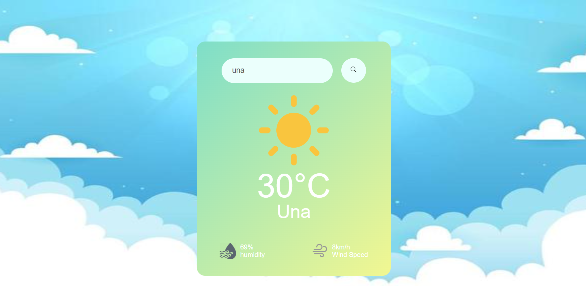

# 🌤️ Weather Webpage

A responsive and user-friendly weather webpage built using **HTML**, **CSS**, and **JavaScript**. It fetches real-time weather data based on the user's input (city name)

## 🔍 Features

- 🌍 Get current weather for any city
- 📍 Detect and show weather using user's geolocation
- 🌡️ Temperature, humidity, wind speed, and weather description
- 🎨 Responsive UI with clean design
- ⚠️ Error handling for invalid city names or API issues

## 🛠️ Technologies Used

- HTML5
- CSS
- JavaScript (Fetch API, DOM Manipulation)
- OpenWeatherMap API

## 📸 Preview

 
## 🌐 Live Demo

🚀 [View the Live Site](https://weather-page-4t7njkkr8-pratiksha-thakurs-projects.vercel.app/)
